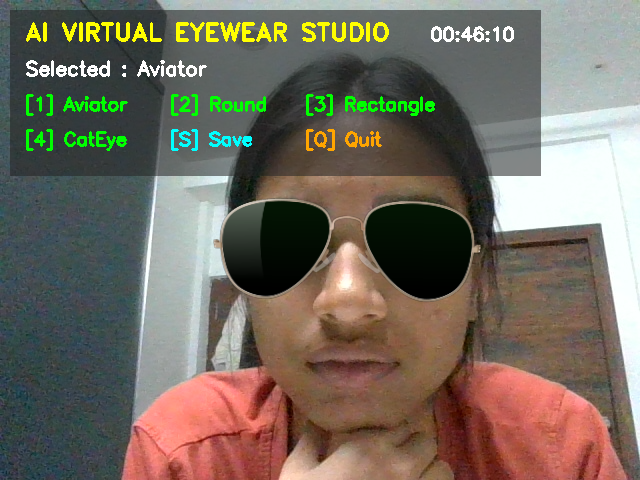
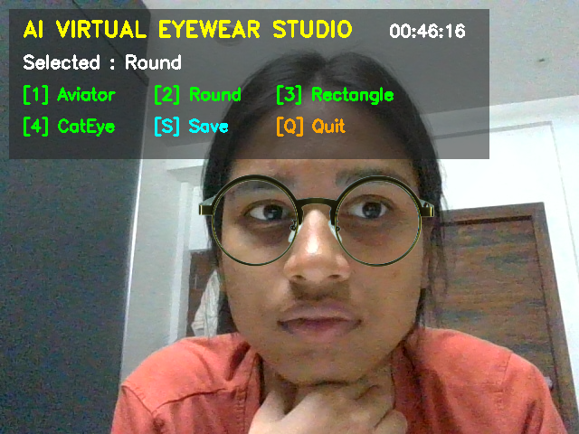
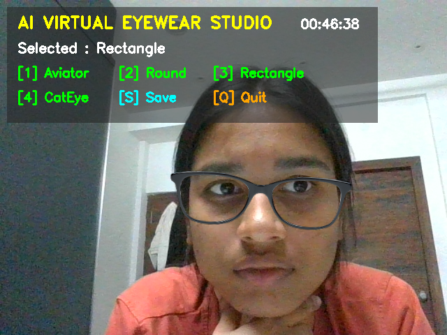
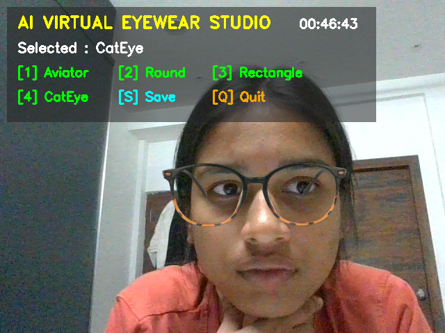

# AI Virtual Eyewear Studio

A real-time computer vision application that allows users to virtually try different eyewear styles using a webcam.

The application detects the user's face and eyes using OpenCV Haar Cascade classifiers, dynamically scales the selected glasses according to facial dimensions, adjusts the glasses based on head tilt, and smoothly overlays them onto the live video feed.

## Demo

### Aviator



### Round



### Rectangle




### Cat-Eye



## Features

- Real-time webcam-based virtual try-on
- Face detection using Haar Cascade classifiers
- Eye detection for glasses positioning
- Automatic glasses scaling based on eye distance and face width
- Head-tilt detection and glasses rotation
- Position smoothing to reduce overlay jitter
- Alpha blending for transparent glasses assets
- Four selectable eyewear styles
- Keyboard-based style switching
- Screenshot capture
- Automatic screenshot directory creation
- Webcam and model loading error handling

## Eyewear Styles

The application currently supports:

1. Aviator
2. Round
3. Rectangle
4. Cat-Eye

Users can switch between styles while the webcam is running.

## Tech Stack

- Python
- OpenCV
- NumPy
- Haar Cascade Classifiers
- Image Processing
- Alpha Blending
- Real-Time Video Processing

## How It Works

The application follows a real-time computer vision pipeline:

```text
Webcam Input
     ↓
Frame Capture
     ↓
Grayscale Conversion
     ↓
Face Detection
     ↓
Eye Detection
     ↓
Eye Distance Calculation
     ↓
Glasses Scaling
     ↓
Head Tilt Estimation
     ↓
Glasses Rotation
     ↓
Position Smoothing
     ↓
Alpha Blending
     ↓
Live Output
```

### 1. Face Detection

Each webcam frame is converted to grayscale and processed using the Haar Cascade face detector.

### 2. Eye Detection

The detected face region is used as the region of interest for eye detection.

The centers of the detected eyes are used as reference points for positioning the glasses.

### 3. Automatic Scaling

The application calculates the distance between the detected eyes and also considers the detected face width.

The glasses are resized dynamically so that they fit different face sizes.

### 4. Head-Tilt Detection

The angle between the two detected eye centers is calculated using:

```python
angle = np.degrees(
    np.arctan2(
        right_eye[1] - left_eye[1],
        right_eye[0] - left_eye[0]
    )
)
```

The glasses are then rotated according to the estimated head tilt.

### 5. Position Smoothing

Temporal smoothing is applied to the glasses position and rotation angle to reduce sudden movements and visual jitter.

### 6. Alpha Blending

Transparent glasses images are blended with the webcam frame using the alpha channel.

This allows the glasses to appear naturally over the user's face without displaying the image background.

## Project Structure

```text
AI-Virtual-Eyewear-Studio/
│
├── assets/
│   └── glasses/
│       ├── aviator.png
│       ├── cateye.png
│       ├── rectangle.png
│       └── round.png
│
├── models/
│   ├── haarcascade_eye.xml
│   └── haarcascade_frontalface_alt.xml
│
├── screenshots/
│   ├── aviator.png
│   ├── cateye.png
│   ├── rectangle.png
│   └── round.png
│
├── glass_virtual_tryon.py
├── requirements.txt
├── .gitignore
└── README.md
```

## Installation

### 1. Clone the repository

```bash
git clone https://github.com/ThalusaniVaishnavi/AI-Virtual-Eyewear-Studio.git
```

### 2. Navigate to the project directory

```bash
cd AI-Virtual-Eyewear-Studio
```

### 3. Install dependencies

```bash
pip install -r requirements.txt
```

## How to Run

Make sure your webcam is connected and accessible.

Run:

```bash
python glass_virtual_tryon.py
```

The application will open the webcam and start the virtual try-on interface.

## Controls

| Key | Action |
|---|---|
| `1` | Select Aviator |
| `2` | Select Round |
| `3` | Select Rectangle |
| `4` | Select Cat-Eye |
| `S` | Capture screenshot |
| `Q` | Quit |
| `ESC` | Quit |

Screenshots are automatically saved inside the `screenshots/` directory.

## Requirements

- Python 3.x
- Webcam
- OpenCV
- NumPy


## Technical Highlights

This project demonstrates practical implementation of:

- Real-time webcam processing
- Object detection using Haar Cascades
- Region-of-interest processing
- Eye-center-based facial alignment
- Dynamic image scaling
- Geometric rotation
- Alpha-channel image compositing
- Temporal smoothing
- Real-time user interaction

## Limitations

The current implementation uses Haar Cascade classifiers, which can be affected by:

- Poor lighting
- Extreme head angles
- Occlusion
- Multiple faces
- Incorrect eye detection

The application is primarily designed for a front-facing webcam and relatively clear facial visibility.

## Future Improvements

Possible future improvements include:

- More accurate facial landmark detection
- Improved glasses alignment using facial landmarks
- Support for more eyewear styles
- Better handling of partial face visibility
- Improved pose estimation
- Graphical user interface for selecting eyewear
- Web-based deployment
- Improved rendering and perspective transformation

## Author

**Vaishnavi**

B.Tech Computer Science & Engineering — Artificial Intelligence & Machine Learning
